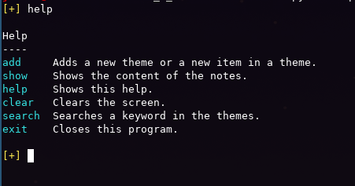

# KnowledgeCLI

## Screenshot

## Description
This CLI program written in python can store your knowledge in themes.

## Usage
- You need to create a "notes" folder in the same directory where your python file is.
- You need python
- You need the module "colorama" installed to show the colors (pip install colorama)

## Platform
- Linux
